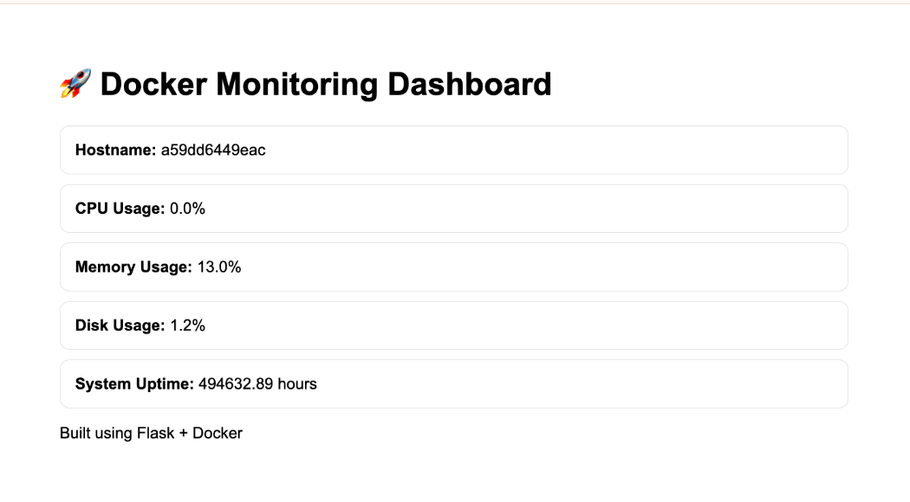

# Docker Monitoring Dashboard

## Dashboard Preview



A lightweight monitoring dashboard built using Flask and Docker.

## Features

* View Hostname
* Monitor CPU Usage
* Monitor Memory Usage
* Monitor Disk Usage
* Monitor System Uptime
* Improved Dashboard UI
* Containerized using Docker

## Tech Stack

* Python
* Flask
* Docker

## Project Structure

docker-monitoring-app/
├── app.py
├── Dockerfile
├── requirements.txt
└── README.md

## Run Locally

Build the Docker image:

```bash
docker build -t monitoring-app .
```

Run the container:

```bash
docker run -d --name monitoring-dashboard -p 5000:5000 monitoring-app
```

Open:

http://localhost:5000

## Future Improvements

* Better UI
* Docker Compose
* Real-time monitoring
* Container statistics
* Grafana integration

## Author

Karuna A
Aspiring DevOps Engineer
